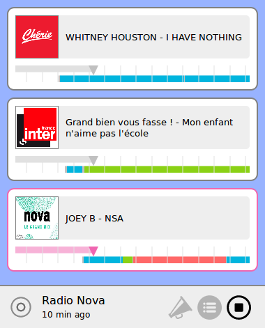
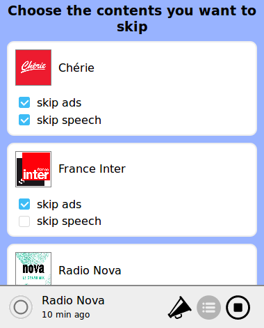
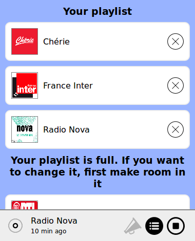

# Adblock Radio Buffer
A player that buffers radio content and lets you fast-forward ads.
Uses [Adblock Radio](https://github.com/adblockradio/adblockradio) as a backend, featuring machine-learning and acoustic fingerprinting techniques.

# Preview

## Player interface

For each radio, metadata is retrieved with the [open source live metadata scraper](https://github.com/adblockradio/webradio-metadata).

A colored bar indicates how much of audio is available. Default setting is to buffer up to 15 minutes.
Each color tells the user about the content of the audio:
- blue for music
- green for talk
- red for ads




## Select the content you want to hear

You can choose what kind of content you want to hear or skip on each radio.

On news stations, it is great just to skip ads.
On musical stations, it's convenient to skip ads and also talk interruptions.




## Many radios available, more to come

At the time of writing, 68 radios are available in the player.

It is planned to add more. You can [submit requests here](https://github.com/adblockradio/available-models/).




## Flag mispredictions to help improve ad detection

TODO


# Installation

## End-users

User-friendly builds are not yet available. Installation instructions expect a minimum of technical knowledge.

Create an empty directory somewhere on your machine, we call it `DIR`.

First, install [Adblock Radio algorithm](https://github.com/adblockradio/adblockradio). You should now have `DIR/adblockradio` with the files inside. In that subdirectory, run `node demo.js` to check everything is working correctly.

Then, install this player. This has been tested with `node` version 10.9.0 and `npm` version 6.4.1. Run these commands in `DIR`, so that `DIR/adblockradio-buffer` will be created:
```
git clone https://github.com/adblockradio/adblockradio-buffer.git
cd adblockradio-buffer
npm install
cd client
npm install
npm run build
cd ..
cp config/default-user.json config/user.json
node index.js
```

Open `http://localhost:9820` in your favorite browser.
Add your radios and enjoy!

## Development

In a first terminal:
```
cd client
npm start
```

In another terminal:
```
env DEV=1 node index.js
```

Open `http://localhost:9820` in your favorite browser.

# Roadmap

- Nicer UI and UX (help would be appreciated)
- Electron builds
- Docker builds (WIP)
- Cordova apps (WIP), or even better React native apps

Contributions welcome.

# Copyright

Copyright 2018, [Alexandre Storelli](https://github.com/dest4)